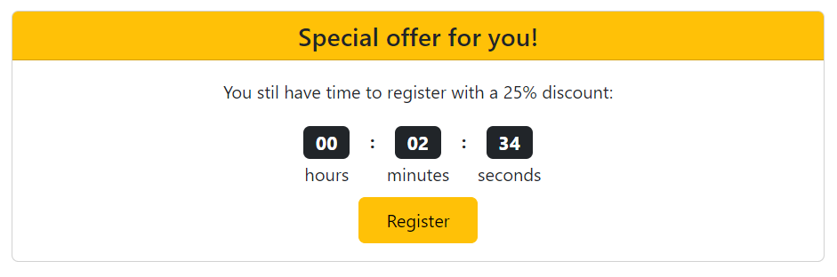

# Company Search


## Table of Contents
* [General Info](#general-info)
* [Website with Project](#website-with-project)
* [Tech Stack](#tech-stack)
* [Collaboration and Project Management](#collaboration-and-project-management)
* [Run Localy](#run-locally)
* [Environment Variables](#environment-variables)
* [Features](#features)
* [Used Libraries with Examples](#used-libraries-with-examples)
* [React Technology Implementation with Examples](#react-technology-implementation-with-examples)
* [Licenses](#licenses)


## General Info
This project is a simple website designed for business owners and their current or prospective employees. 
By registering on the site, an employer has the opportunity to add their company to the database, specify whether a recruitment process is currently underway, and what benefits await future employees. 
An employee registering on the site can browse the list of companies or rate their employer’s company.


## Website with Project
```
https://company-search-58307.web.app/
```


## Tech Stack
**Client:** React 17.0.1, Bootstrap 5.3.1

**Server:** Hosted on Firebase

**Database:** Firebase (Firebase SDK: 10.4.0)


## Collaboration and Project Management
During the project, two GitHub accounts were used to simulate group work. The main assumption of this approach was to practice sending pull requests, updating branches and resolving conflicts.


## Run Locally
Clone the project  
```bash
  git clone https://github.com/WojciechK92/company-search.git
```
Go to the project directory
```bash
  cd company-search
```
Install dependencies
```bash
  npm install
```
Start the server
```bash
  npm run start
```


## Environment Variables
To run this project, you need to add the following environment variables to your .env file. You can find them in your web app’s Firebase configuration:

`const firebaseConfig = {`

    apiKey: REACT_APP_AUTH_KEY,
    authDomain: REACT_APP_AUTH_DOMAIN,
    databaseURL: REACT_APP_DATABASE,
    projectId: REACT_APP_PROJECT_ID,
    storageBucket: REACT_APP_STORAGE_BUCKET,
    messagingSenderId: REACT_APP_MESSAGING_SENDER_ID,
    appId: REACT_APP_ID,
  
`};`


## Features
1. Responsiveness  
The website is fully responsive. You can use it on a mobile device and a PC.

2. Authentication  
User authentication consists of the registration, login and profile update pages. 
All forms include email and password validation. Additionally, until the form is completed correctly, the button is blocked.


Updating the user profile requires re-authorization by entering the current password.


3. Searchbar and theme button  
The page header contains a search bar and a theme button. 
The search engine searches the entire company collection and displays the results sorted by name. 
The theme button changes the colors of the buttons on the page.


4. Special offer  
A user who visits the website for the first time can register cheaper.
The form disappears after time expires or after the user registers.




5. Recently viewed company  
If the user has already visited the address of a company, it will be displayed on the home page.
The user can visit the last visited company or turn off the window.


6. My companies  
The user can add, edit or delete companies created by him.
Add and edit companies forms include data validation.


7. Connection to database  
If connection was successful the modal will be displayed.


## Used Libraries with Examples
1. Bootstrap
- [src/index.js](https://github.com/WojciechK92/company-search/blob/4e29140f8313db5622c5c9ee28644f666ead6b51/src/index.js)
- [src/pages/Auth/AuthForm.js](https://github.com/WojciechK92/company-search/blob/4e29140f8313db5622c5c9ee28644f666ead6b51/src/pages/Auth/AuthForm.js)

2. Axios
- [src/axios.js](https://github.com/WojciechK92/company-search/blob/4e29140f8313db5622c5c9ee28644f666ead6b51/src/axios.js)
- [src/pages/Home/Home.js](https://github.com/WojciechK92/company-search/blob/4e29140f8313db5622c5c9ee28644f666ead6b51/src/pages/Home/Home.js)

3. Firebase
- [src/firebase.js](https://github.com/WojciechK92/company-search/blob/4e29140f8313db5622c5c9ee28644f666ead6b51/src/firebase.js)
- [src/pages/Auth/Login.js](https://github.com/WojciechK92/company-search/blob/4e29140f8313db5622c5c9ee28644f666ead6b51/src/pages/Auth/Login.js)

4. React-modal
- [src/components/UI/ModalButton/ModalButton.js](https://github.com/WojciechK92/company-search/blob/4e29140f8313db5622c5c9ee28644f666ead6b51/src/components/UI/ModalButton/ModalButton.js)
- [src/components/UI/ModalInfo/ModalInfo.js](https://github.com/WojciechK92/company-search/blob/4e29140f8313db5622c5c9ee28644f666ead6b51/src/components/UI/ModalInfo/ModalInfo.js)

5. React-rating-stars-component
- [src/pages/Company/Company.js](https://github.com/WojciechK92/company-search/blob/4e29140f8313db5622c5c9ee28644f666ead6b51/src/pages/Company/Company.js)

6. React-router-dom
- [src/App.js](https://github.com/WojciechK92/company-search/blob/4e29140f8313db5622c5c9ee28644f666ead6b51/src/App.js)
- [src/components/UI/LinkButton/LinkButton.js](https://github.com/WojciechK92/company-search/blob/4e29140f8313db5622c5c9ee28644f666ead6b51/src/components/UI/LinkButton/LinkButton.js)

7. Prop-types
- [src/components/Companies/Company/Company.js](https://github.com/WojciechK92/company-search/blob/4e29140f8313db5622c5c9ee28644f666ead6b51/src/components/Companies/Company/Company.js)


## React Technology Implementation with Examples
1. Class component
- [src/App.js(in the past)](https://github.com/WojciechK92/company-search/blob/63322a658701e28ebadf8cddcc12f7b3dd9c6dfa/src/App.js)

2. Function component
- [src/App.js](https://github.com/WojciechK92/company-search/blob/4e29140f8313db5622c5c9ee28644f666ead6b51/src/App.js)

3. Props
- [src/pages/Home/Home.js](https://github.com/WojciechK92/company-search/blob/4e29140f8313db5622c5c9ee28644f666ead6b51/src/pages/Home/Home.js)
- [src/components/Companies/Company/Company.js](https://github.com/WojciechK92/company-search/blob/4e29140f8313db5622c5c9ee28644f666ead6b51/src/components/Companies/Company/Company.js)

4. Composition
- [src/components/UI/LinkButton/LinkButton.js](https://github.com/WojciechK92/company-search/blob/4e29140f8313db5622c5c9ee28644f666ead6b51/src/components/UI/LinkButton/LinkButton.js)

5. UseState
- [src/hooks/useStateStorage.js](https://github.com/WojciechK92/company-search/blob/4e29140f8313db5622c5c9ee28644f666ead6b51/src/hooks/useStateStorage.js)

5. UseContext
- [src/context/themeContext.js](https://github.com/WojciechK92/company-search/blob/4e29140f8313db5622c5c9ee28644f666ead6b51/src/context/themeContext.js)
- [src/App.js](https://github.com/WojciechK92/company-search/blob/4e29140f8313db5622c5c9ee28644f666ead6b51/src/App.js)
- [src/components/UI/SearchBar/SearchBar.js](https://github.com/WojciechK92/company-search/blob/4e29140f8313db5622c5c9ee28644f666ead6b51/src/components/UI/SearchBar/SearchBar.js)

6. UseReducer
- [src/reducer.js](https://github.com/WojciechK92/company-search/blob/4e29140f8313db5622c5c9ee28644f666ead6b51/src/reducer.js)
- [src/App.js](https://github.com/WojciechK92/company-search/blob/4e29140f8313db5622c5c9ee28644f666ead6b51/src/App.js)
- [src/hooks/useAuth.js](https://github.com/WojciechK92/company-search/blob/4e29140f8313db5622c5c9ee28644f666ead6b51/src/hooks/useAuth.js)

7. Higher-Order Component
- [src/hoc/withMouseEffect.js](https://github.com/WojciechK92/company-search/blob/4e29140f8313db5622c5c9ee28644f666ead6b51/src/hoc/withMouseEffect.js)
- [src/hoc/ErrorBoundary.js](https://github.com/WojciechK92/company-search/blob/4e29140f8313db5622c5c9ee28644f666ead6b51/src/hoc/ErrorBoundary.js)

8. UseEffect, useEffect with cleanup
- [src/pages/Home/Home.js](https://github.com/WojciechK92/company-search/blob/4e29140f8313db5622c5c9ee28644f666ead6b51/src/pages/Home/Home.js)
- [src/components/Other/Timer/Timer.js](https://github.com/WojciechK92/company-search/blob/4e29140f8313db5622c5c9ee28644f666ead6b51/src/components/Other/Timer/Timer.js)

9. UseRef
- [src/components/UI/ModalInfo/ModalInfo.js](https://github.com/WojciechK92/company-search/blob/4e29140f8313db5622c5c9ee28644f666ead6b51/src/components/UI/ModalInfo/ModalInfo.js)

9. My hooks 
- [src/hooks/useStateStorage.js](https://github.com/WojciechK92/company-search/blob/4e29140f8313db5622c5c9ee28644f666ead6b51/src/hooks/useStateStorage.js)
- [src/hooks/useAuth.js](https://github.com/WojciechK92/company-search/blob/4e29140f8313db5622c5c9ee28644f666ead6b51/src/hooks/useAuth.js)

10. Error boundary
- [src/hoc/ErrorBoundary.js](https://github.com/WojciechK92/company-search/blob/4e29140f8313db5622c5c9ee28644f666ead6b51/src/hoc/ErrorBoundary.js)

11. Lazy
- [src/App.js](https://github.com/WojciechK92/company-search/blob/4e29140f8313db5622c5c9ee28644f666ead6b51/src/App.js)


## Licenses
1. Photos  
The photos used in this project come from two sources. Photos shared there can be freely published:
- [Unsplash](https://unsplash.com)
- [Picsum](https://picsum.photos)

2. Access to the data  
I would like to provide recruiters with free access to data in this project. Please remember that any information contained in this project is intended for recruitment purposes only and should not be used in any other way without my express consent.

